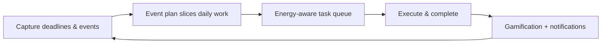

# DisciPlan — Project Overview

> **Tagline:** *Discipline your data. Plan your success.*

DisciPlan is an ** academic second brain** built for **United International University (UIU)**. It turns looming deadlines, class schedules, and section coordination into a **calm, daily blueprint** — paced to the student's energy, not their panic.

---

## 1. What Is DisciPlan?

DisciPlan is a **full-stack academic operating system** that unifies:

| Layer | What it does |
|-------|----------------|
| **Personal planner** | Daily task queue, energy-aware sorting, calendar, event plans |
| **Course workspace** | Per-course tasks, blogs, practice problems |
| **Section hub** | Announcements, doubts, chat, resources, exams, gradebook, teams |
| **Community** | Forum, blogs, searchable Q&A, gamification |
| **Institution** | Admin console for curriculum, enrollments, faculty, moderation |

Students get one place to **capture → strategize → execute**. Faculty get tools to teach, grade, and coordinate sections. Admins govern the academic catalogue and trust layer.

---

## 2. The Problem

University students face a predictable crisis every semester:

1. **Deadline overwhelm** — CTs, assignments, labs, and presentations stack up without a daily plan.
2. **Energy mismatch** — Students attempt hard tasks on low-energy days and burn out.
3. **Tool fragmentation** — Planner apps, LMS fragments, WhatsApp groups, Google Drive, and spreadsheets don't talk to each other.
4. **Section chaos** — Announcements in one channel, doubts in another, files somewhere else.
5. **Low engagement** — Academic tools feel like chores; students disengage.
6. **Institutional trust** — Faculty verification, enrollment control, and content moderation need admin oversight.

**Result:** missed deadlines, poor time allocation, repeated questions, and faculty/admin overhead.

---

## 3. The DisciPlan Solution

### 3.1 Intelligent daily planning

- **Event plans** break big deadlines into **daily slices** with carryover when a day is missed.
- **Live task weighting** sorts today's queue by priority, urgency, completion %, reschedule count, and energy fit.
- **Daily energy bar** lets students declare how they feel; tasks reorder to match capacity.

### 3.2 Unified academic hub

- **Dashboard** (`/dashboard`) — tasks, calendar, upcoming events, energy.
- **Courses** — per-course tasks, blogs, practice.
- **Section Hub** — announcements, doubts, chat, resources, exams, gradebook, project teams.
- **Forum & Blogs** — peer learning with voting and faculty verification.
- **Teams** — faculty-assigned project groups with tasks and chat.

### 3.3 Trust & governance

- **UIU email** (`@uiu.ac.bd`) + OTP verification at signup.
- **Faculty roster** — only rostered emails become faculty automatically.
- **Faculty verification queue** for self-signup faculty pending approval.
- **Admin console** — courses, sections, enrollments, publishing, moderation, audit logs.

### 3.4 Engagement through gamification

- XP, **10 tiers** (Recruit → Titan), badges, achievements, streaks, leaderboard.
- Points awarded for helpful answers, blog contributions, task completion — with caps to prevent abuse.

---

## 4. User Roles

| Role | Access |
|------|--------|
| **Student** | Planner, courses, section hub, doubts, forum, blogs, teams, practice, leaderboard |
| **Faculty** | Faculty dashboard, section management, grading, doubt answers, team assignment, announcements |
| **Admin** | Full system console — academic structure, users, roster, moderation, global announcements |

Faculty may start in **pending** status until an admin approves verification.

---

## 5. Technology Stack

```
┌─────────────────────────────────────────────────────────────┐
│  Frontend (DisciPlan-frontend)                              │
│  React 19 · TypeScript · TanStack Router · React Query      │
│  Tailwind CSS · Radix UI · Vite · Cloudflare deploy         │
└──────────────────────────┬──────────────────────────────────┘
                           │ REST + WebSocket
┌──────────────────────────▼──────────────────────────────────┐
│  Backend (DisciPlan-backend)                                  │
│  FastAPI · Uvicorn · Raw parameterized SQL (no ORM)         │
│  JWT auth · bcrypt · python-jose                              │
└──────────────────────────┬──────────────────────────────────┘
                           │
┌──────────────────────────▼──────────────────────────────────┐
│  MySQL (Aiven) — 50+ normalized tables, views, FULLTEXT     │
│  Cloudinary — file storage (PDF, DOCX, images)                │
└───────────────────────────────────────────────────────────────┘
```

**Design choice:** No ORM. Every query is **explicit SQL** in repository files — auditable, optimizable, and ideal for academic evaluation.

---

## 6. Core Product Loop



1. **Capture** — Add CT, assignment, or personal event (or link to grading portal).
2. **Strategize** — Event plan engine divides work across days until deadline.
3. **Execute** — Sorted task list + section hub for course-specific work.
4. **Reflect** — XP, achievements, calendar history.

---

## 7. Major Modules

### Dashboard & Planner
- Today's tasks with **live_weight** sorting
- Academic calendar (events + task due dates merged)
- Event plans: `deadline_divide`, `grading_linked`, `one_time`, `recurring_weekly`, `calendar_only`
- Auto-generated lecture-prep tasks for faculty

### Section Hub
- Announcements with threaded comments
- **Fuzzy doubt search** (FULLTEXT + LIKE across title, body, answers)
- Real-time section chat (WebSocket + REST fallback)
- Section resources (files via Cloudinary)
- Assessment portals & submissions
- Configurable gradebook rubric
- Faculty-assigned project teams

### Community
- Course blogs with topics, votes, faculty verification
- Course forum threads & replies
- Central doubts search across enrolled sections

### Admin
- Departments, courses, sections, meeting times
- Enrollment requests & bulk import
- Faculty roster & verification
- Content reports & moderation
- Global announcements by role
- Audit logs

---

## 8. API Architecture

- **Base URL:** `/api/v1`
- **Pattern:** `Router → Service → Repository → MySQL`
- **Auth:** Bearer JWT; role checks via `require_roles()`
- **Files:** Upload to Cloudinary; metadata in `files` table; authenticated download proxy

Key router groups: `auth`, `dashboard`, `sections`, `courses`, `blogs`, `forum`, `teams`, `assessments`, `practice`, `admin`, `gamification`, `notifications`, `chat`, `files`.

---

## 9. Frontend Routes (Professional Permalinks)

| Route | Purpose |
|-------|---------|
| `/` | Marketing landing |
| `/login`, `/signup` | Authentication |
| `/dashboard` | Main workspace (student/faculty/admin) |
| `/courses`, `/courses/:code` | Course catalogue & detail |
| `/courses/:code/section` | Section hub (tab in URL: `?tab=section-resources`) |
| `/doubts` | Cross-course doubt search |
| `/forum` | Course discussions |
| `/teams/:id` | Project team workspace |
| `/leaderboard`, `/achievements` | Gamification |
| `/admin` | Redirects to admin dashboard view |

---

## 10. Why DisciPlan Wins (Evaluation Angles)

| Criterion | DisciPlan strength |
|-----------|-------------------|
| **Real-world problem** | Solves actual student deadline stress at UIU |
| **Technical depth** | Custom SQL weighting, event slicing, FULLTEXT search — not CRUD-only |
| **Normalization** | 3NF/BCNF schema with lookup tables, no redundant enums |
| **Security** | JWT, role-based access, parameterized queries, faculty roster |
| **UX** | Optimistic UI updates, URL-persisted tabs, energy-aware sorting |
| **Scale path** | Views for hot reads, indexes on poll/notification paths, connection pooling |

---

## 11. Repository Layout

```
DisciPlan/
├── DisciPlan-frontend/     React SPA
│   ├── src/routes/         File-based routing
│   ├── src/hooks/          React Query data layer
│   └── documentation/      This documentation set
└── DisciPlan-backend/      FastAPI API
    ├── app/routers/        HTTP endpoints
    ├── app/services/       Business logic (event plans, grading sync)
    ├── app/repositories/   Raw SQL queries
    └── sql/                Migrations 001–026 + seeds
```

---

## 12. Demo Flow (Suggested for Project Show)

1. **Landing** → Sign up as student with UIU email.
2. **Onboarding** → Pick sections; land on **Dashboard**.
3. **Add Event** → Create assignment with deadline; show **daily slices** appearing.
4. **Energy bar** → Set low energy; show task reorder.
5. **Course → Section Hub** → Post doubt; demonstrate **fuzzy search**.
6. **Faculty view** → Answer doubt, verify, grade submission.
7. **Admin** → Show course/section management and moderation queue.
8. **Gamification** → Leaderboard and tier badge.

---

*DisciPlan — Turn looming deadlines into calm, daily focus.*
