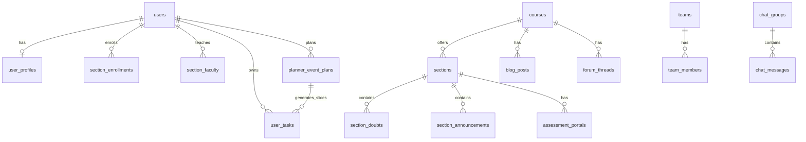

# DisciPlan — Complete MySQL Schema (ERD Reference)

> **Purpose:** Single reference for building an ERD and understanding every table.  
> **Source of truth:** `DisciPlan-backend/sql/` applied in numeric order (`001` → `026`).  
> **Engine:** InnoDB · **Charset:** utf8mb4_unicode_ci · **Normalization:** 3NF / BCNF

---

## ERD Domain Map



---

## Table Index (70+ entities)

| Domain | Tables |
|--------|--------|
| **Lookups** | `roles`, `user_statuses`, `departments`, `semesters`, `days_of_week`, `notification_types`, `reference_entity_types`, `file_storage_providers`, `assessment_types`, `submission_statuses`, `forum_thread_types`, `chat_group_types`, `team_member_roles`, `team_invitation_statuses`, `audit_action_types`, `blog_post_statuses`, `author_roles`, `vote_directions`, `report_reasons`, `report_statuses`, `task_priorities`, `energy_levels`, `planner_task_types`, `gamification_tiers`, `course_types`, `badge_types` |
| **Identity** | `users`, `user_profiles`, `user_preferences`, `otp_verifications`, `refresh_tokens` |
| **Gamification** | `user_gamification`, `point_transactions`, `user_badges`, `achievement_definitions`, `user_achievement_progress`, `user_streaks`, `point_award_caps` |
| **Files** | `files` |
| **Academic** | `courses`, `sections`, `section_meeting_times`, `section_faculty`, `section_enrollments`, `course_user_preferences`, `syllabus_topics`, `course_types` |
| **Section hub** | `section_announcements`, `section_announcement_comments`, `section_resources`, `section_doubts`, `section_doubt_answers`, `section_doubt_votes` |
| **Chat** | `chat_groups`, `chat_group_members`, `chat_messages`, `chat_message_reads`, `chat_message_attachments` |
| **Assessments** | `assessment_portals`, `submissions`, `submission_files`, `section_grade_components`, `section_grades`, `grade_scales`, `student_semester_summaries` |
| **Blogs** | `blog_posts`, `blog_post_votes`, `blog_comments`, `blog_tags`, `blog_post_tags` |
| **Forum** | `forum_threads`, `forum_thread_votes`, `forum_replies`, `forum_reply_votes`, `forum_thread_attachments` |
| **Practice** | `practice_problems`, `practice_tags`, `practice_problem_tags`, `past_papers` |
| **Teams** | `teams`, `team_members`, `team_invitations`, `team_tasks`, `team_important_dates`, `team_announcements`, `user_pinned_teams` |
| **Planner** | `user_tasks`, `user_daily_energy`, `user_lecture_task_log`, `calendar_events`, `planner_event_plans`, `planner_event_recurrence` |
| **Admin** | `global_announcements`, `global_announcement_audiences`, `audit_logs`, `content_reports`, `faculty_roster`, `faculty_verification_requests`, `section_enrollment_requests` |
| **Notifications** | `notifications` |
| **Views** | `v_user_unread_notification_counts`, `v_chat_group_last_messages`, `v_chat_group_unread_counts`, `v_section_enrollment_counts`, `v_blog_post_scores`, `v_leaderboard_all_time`, `v_leaderboard_today` |

---

## Consolidated Schema (Annotated SQL)

Apply migrations in order. Below is the **logical full schema** with inline comments for ERD tooling.

```sql
-- =============================================================================
-- DISCIPLAN — COMPLETE MYSQL SCHEMA (annotated for ERD)
-- =============================================================================

SET NAMES utf8mb4;
SET FOREIGN_KEY_CHECKS = 0;

-- ─────────────────────────────────────────────────────────────────────────────
-- LOOKUP TABLES (no FK dependencies — seed via 002_seed.sql)
-- ─────────────────────────────────────────────────────────────────────────────

CREATE TABLE roles (
    id          TINYINT UNSIGNED NOT NULL AUTO_INCREMENT,
    code        VARCHAR(20)      NOT NULL,  -- student | faculty | admin
    label       VARCHAR(50)      NOT NULL,
    PRIMARY KEY (id),
    UNIQUE KEY uq_roles_code (code)
); -- RELATION: users.role_id → roles.id

CREATE TABLE user_statuses (
    id          TINYINT UNSIGNED NOT NULL AUTO_INCREMENT,
    code        VARCHAR(20)      NOT NULL,  -- active | pending | suspended
    label       VARCHAR(50)      NOT NULL,
    PRIMARY KEY (id),
    UNIQUE KEY uq_user_statuses_code (code)
); -- RELATION: users.status_id → user_statuses.id

CREATE TABLE departments (
    id          SMALLINT UNSIGNED NOT NULL AUTO_INCREMENT,
    code        VARCHAR(20)       NOT NULL,  -- e.g. CSE
    name        VARCHAR(120)      NOT NULL,
    PRIMARY KEY (id),
    UNIQUE KEY uq_departments_code (code)
); -- RELATION: courses.department_id, user_profiles.department_id

CREATE TABLE semesters (
    id          SMALLINT UNSIGNED NOT NULL AUTO_INCREMENT,
    code        VARCHAR(20)       NOT NULL,
    label       VARCHAR(80)       NOT NULL,
    starts_on   DATE              NOT NULL,
    ends_on     DATE              NOT NULL,
    is_current  TINYINT(1)        NOT NULL DEFAULT 0,
    PRIMARY KEY (id),
    UNIQUE KEY uq_semesters_code (code)
); -- RELATION: sections.semester_id → semesters.id

CREATE TABLE days_of_week (
    id          TINYINT UNSIGNED NOT NULL,
    code        CHAR(3)          NOT NULL,  -- SUN, MON, ...
    label       VARCHAR(12)      NOT NULL,
    sort_order  TINYINT UNSIGNED NOT NULL,
    PRIMARY KEY (id)
); -- RELATION: section_meeting_times.day_id

CREATE TABLE task_priorities (
    id          TINYINT UNSIGNED NOT NULL AUTO_INCREMENT,
    code        VARCHAR(20)      NOT NULL,  -- low | med | high | critical
    label       VARCHAR(40)      NOT NULL,
    sort_order  TINYINT UNSIGNED NOT NULL,  -- used in live_weight formula
    PRIMARY KEY (id),
    UNIQUE KEY uq_task_priorities_code (code)
); -- RELATION: user_tasks.priority_id, team_tasks.priority_id

CREATE TABLE energy_levels (
    id          TINYINT UNSIGNED NOT NULL AUTO_INCREMENT,
    code        VARCHAR(20)      NOT NULL,  -- low | medium | high
    label       VARCHAR(40)      NOT NULL,
    sort_order  TINYINT UNSIGNED NOT NULL,  -- used for energy-aware task sort
    PRIMARY KEY (id),
    UNIQUE KEY uq_energy_levels_code (code)
); -- RELATION: user_tasks.energy_level_id, user_daily_energy.energy_level_id

CREATE TABLE planner_task_types (
    id          TINYINT UNSIGNED NOT NULL AUTO_INCREMENT,
    code        VARCHAR(40)      NOT NULL,  -- ct, assignment, lecture, grading, ...
    label       VARCHAR(80)      NOT NULL,
    role_scope  ENUM('student', 'faculty', 'both') NOT NULL,
    sort_order  TINYINT UNSIGNED NOT NULL DEFAULT 0,
    PRIMARY KEY (id),
    UNIQUE KEY uq_planner_task_types_code (code)
); -- RELATION: user_tasks.planner_task_type_id, planner_event_plans.planner_task_type_id

CREATE TABLE gamification_tiers (
    id              TINYINT UNSIGNED NOT NULL AUTO_INCREMENT,
    code            VARCHAR(30)      NOT NULL,  -- recruit → titan (10 tiers)
    label           VARCHAR(60)      NOT NULL,
    min_points      INT UNSIGNED     NOT NULL,
    next_tier_id    TINYINT UNSIGNED NULL,       -- self-referential tier chain
    PRIMARY KEY (id),
    UNIQUE KEY uq_gamification_tiers_code (code),
    CONSTRAINT fk_gamification_tiers_next
        FOREIGN KEY (next_tier_id) REFERENCES gamification_tiers (id)
); -- RELATION: user_gamification.tier_id

-- (Additional lookups: notification_types, reference_entity_types,
--  file_storage_providers, assessment_types, submission_statuses,
--  forum_thread_types, chat_group_types, team_member_roles,
--  team_invitation_statuses, audit_action_types, blog_post_statuses,
--  author_roles, vote_directions, report_reasons, report_statuses, badge_types)
-- See sql/001_schema.sql and sql/006_features.sql for full DDL.

-- ─────────────────────────────────────────────────────────────────────────────
-- IDENTITY & AUTH
-- ─────────────────────────────────────────────────────────────────────────────

CREATE TABLE users (
    id              BIGINT UNSIGNED  NOT NULL AUTO_INCREMENT,
    email           VARCHAR(255)     NOT NULL,  -- must be @uiu.ac.bd
    password_hash   VARCHAR(255)     NOT NULL,
    role_id         TINYINT UNSIGNED NOT NULL,
    status_id       TINYINT UNSIGNED NOT NULL,
    email_verified  TINYINT(1)       NOT NULL DEFAULT 0,
    created_at      DATETIME(3)      NOT NULL DEFAULT CURRENT_TIMESTAMP(3),
    updated_at      DATETIME(3)      NOT NULL DEFAULT CURRENT_TIMESTAMP(3) ON UPDATE CURRENT_TIMESTAMP(3),
    last_login_at   DATETIME(3)      NULL,
    PRIMARY KEY (id),
    UNIQUE KEY uq_users_email (email),
    CONSTRAINT fk_users_role FOREIGN KEY (role_id) REFERENCES roles (id),
    CONSTRAINT fk_users_status FOREIGN KEY (status_id) REFERENCES user_statuses (id)
); -- Central identity. One user → one profile, many enrollments/tasks.

CREATE TABLE user_profiles (
    user_id         BIGINT UNSIGNED  NOT NULL,
    display_name    VARCHAR(120)     NOT NULL,
    department_id   SMALLINT UNSIGNED NULL,
    avatar_file_id  BIGINT UNSIGNED  NULL,
    avatar_preset   VARCHAR(40)      NULL,
    bio             VARCHAR(500)     NULL,
    created_at      DATETIME(3)      NOT NULL DEFAULT CURRENT_TIMESTAMP(3),
    updated_at      DATETIME(3)      NOT NULL DEFAULT CURRENT_TIMESTAMP(3) ON UPDATE CURRENT_TIMESTAMP(3),
    PRIMARY KEY (user_id),
    CONSTRAINT fk_user_profiles_user FOREIGN KEY (user_id) REFERENCES users (id) ON DELETE CASCADE,
    CONSTRAINT fk_user_profiles_department FOREIGN KEY (department_id) REFERENCES departments (id)
); -- 1:1 with users. display_name shown in doubts, blogs, chat.

CREATE TABLE otp_verifications (
    id              BIGINT UNSIGNED NOT NULL AUTO_INCREMENT,
    email           VARCHAR(255)    NOT NULL,
    code_hash       VARCHAR(255)    NOT NULL,
    expires_at      DATETIME(3)     NOT NULL,
    consumed_at     DATETIME(3)     NULL,
    created_at      DATETIME(3)     NOT NULL DEFAULT CURRENT_TIMESTAMP(3),
    PRIMARY KEY (id),
    KEY idx_otp_email_expires (email, expires_at)
); -- Signup email OTP verification flow.

CREATE TABLE refresh_tokens (
    id              BIGINT UNSIGNED NOT NULL AUTO_INCREMENT,
    user_id         BIGINT UNSIGNED NOT NULL,
    token_hash      CHAR(64)        NOT NULL,
    expires_at      DATETIME(3)     NOT NULL,
    revoked_at      DATETIME(3)     NULL,
    created_at      DATETIME(3)     NOT NULL DEFAULT CURRENT_TIMESTAMP(3),
    PRIMARY KEY (id),
    UNIQUE KEY uq_refresh_tokens_hash (token_hash),
    CONSTRAINT fk_refresh_tokens_user FOREIGN KEY (user_id) REFERENCES users (id) ON DELETE CASCADE
); -- JWT refresh token rotation.

-- ─────────────────────────────────────────────────────────────────────────────
-- FILES (metadata only — binaries on Cloudinary)
-- ─────────────────────────────────────────────────────────────────────────────

CREATE TABLE files (
    id                  BIGINT UNSIGNED  NOT NULL AUTO_INCREMENT,
    storage_provider_id TINYINT UNSIGNED NOT NULL,
    storage_key         VARCHAR(255)     NOT NULL,
    secure_url          VARCHAR(512)     NOT NULL,
    original_filename   VARCHAR(255)     NOT NULL,
    mime_type           VARCHAR(120)     NOT NULL,
    size_bytes          BIGINT UNSIGNED  NOT NULL,
    uploaded_by_user_id BIGINT UNSIGNED  NOT NULL,
    created_at          DATETIME(3)      NOT NULL DEFAULT CURRENT_TIMESTAMP(3),
    deleted_at          DATETIME(3)      NULL,
    PRIMARY KEY (id),
    CONSTRAINT fk_files_uploader FOREIGN KEY (uploaded_by_user_id) REFERENCES users (id)
); -- RELATION: section_resources.file_id, submissions via submission_files,
--   blog cover images, task attachments, chat attachments.

-- ─────────────────────────────────────────────────────────────────────────────
-- ACADEMIC CATALOGUE
-- ─────────────────────────────────────────────────────────────────────────────

CREATE TABLE courses (
    id              INT UNSIGNED     NOT NULL AUTO_INCREMENT,
    code            VARCHAR(20)      NOT NULL,  -- e.g. CSE 3522
    title           VARCHAR(200)     NOT NULL,
    department_id   SMALLINT UNSIGNED NOT NULL,
    credit_hours    DECIMAL(3,1)     NOT NULL DEFAULT 3.0,
    has_project     TINYINT(1)       NOT NULL DEFAULT 0,
    course_type_id  SMALLINT UNSIGNED NULL,      -- migration 019
    is_active       TINYINT(1)       NOT NULL DEFAULT 1,
    created_at      DATETIME(3)      NOT NULL DEFAULT CURRENT_TIMESTAMP(3),
    PRIMARY KEY (id),
    UNIQUE KEY uq_courses_code (code),
    CONSTRAINT fk_courses_department FOREIGN KEY (department_id) REFERENCES departments (id)
); -- Parent of sections, blogs, forum threads, practice problems.

CREATE TABLE sections (
    id              INT UNSIGNED     NOT NULL AUTO_INCREMENT,
    course_id       INT UNSIGNED     NOT NULL,
    semester_id     SMALLINT UNSIGNED NOT NULL,
    section_label   CHAR(2)          NOT NULL,  -- A, B, C, ...
    room            VARCHAR(40)      NULL,
    schedule_key    VARCHAR(80)      NULL,      -- migration 020 — display schedule
    capacity        SMALLINT UNSIGNED NOT NULL DEFAULT 40,
    is_active       TINYINT(1)       NOT NULL DEFAULT 1,
    PRIMARY KEY (id),
    UNIQUE KEY uq_sections_course_semester_label (course_id, semester_id, section_label),
    CONSTRAINT fk_sections_course FOREIGN KEY (course_id) REFERENCES courses (id),
    CONSTRAINT fk_sections_semester FOREIGN KEY (semester_id) REFERENCES semesters (id)
); -- Hub for enrollments, announcements, doubts, chat, grades, teams.

CREATE TABLE section_meeting_times (
    id              INT UNSIGNED     NOT NULL AUTO_INCREMENT,
    section_id      INT UNSIGNED     NOT NULL,
    day_id          TINYINT UNSIGNED NOT NULL,
    starts_at       TIME             NOT NULL,
    ends_at         TIME             NOT NULL,
    PRIMARY KEY (id),
    CONSTRAINT fk_section_meeting_section FOREIGN KEY (section_id) REFERENCES sections (id) ON DELETE CASCADE,
    CONSTRAINT fk_section_meeting_day FOREIGN KEY (day_id) REFERENCES days_of_week (id)
); -- Weekly class schedule. Used for routine view + lecture task auto-generation.

CREATE TABLE section_faculty (
    section_id      INT UNSIGNED     NOT NULL,
    faculty_user_id BIGINT UNSIGNED  NOT NULL,
    assigned_at     DATETIME(3)      NOT NULL DEFAULT CURRENT_TIMESTAMP(3),
    PRIMARY KEY (section_id, faculty_user_id),
    CONSTRAINT fk_section_faculty_section FOREIGN KEY (section_id) REFERENCES sections (id) ON DELETE CASCADE,
    CONSTRAINT fk_section_faculty_user FOREIGN KEY (faculty_user_id) REFERENCES users (id) ON DELETE CASCADE
); -- M:N faculty ↔ sections they teach.

CREATE TABLE section_enrollments (
    id              BIGINT UNSIGNED  NOT NULL AUTO_INCREMENT,
    section_id      INT UNSIGNED     NOT NULL,
    student_user_id BIGINT UNSIGNED  NOT NULL,
    enrolled_at     DATETIME(3)      NOT NULL DEFAULT CURRENT_TIMESTAMP(3),
    dropped_at      DATETIME(3)      NULL,
    PRIMARY KEY (id),
    UNIQUE KEY uq_section_enrollment_active (section_id, student_user_id, dropped_at),
    CONSTRAINT fk_section_enrollments_section FOREIGN KEY (section_id) REFERENCES sections (id),
    CONSTRAINT fk_section_enrollments_student FOREIGN KEY (student_user_id) REFERENCES users (id)
); -- M:N students ↔ sections. dropped_at NULL = active enrollment.

-- ─────────────────────────────────────────────────────────────────────────────
-- SECTION HUB
-- ─────────────────────────────────────────────────────────────────────────────

CREATE TABLE section_announcements (
    id                  BIGINT UNSIGNED NOT NULL AUTO_INCREMENT,
    section_id          INT UNSIGNED    NOT NULL,
    author_user_id      BIGINT UNSIGNED NOT NULL,
    title               VARCHAR(200)    NOT NULL,
    body                TEXT            NOT NULL,
    is_pinned           TINYINT(1)      NOT NULL DEFAULT 0,
    created_at          DATETIME(3)     NOT NULL DEFAULT CURRENT_TIMESTAMP(3),
    deleted_at          DATETIME(3)     NULL,
    PRIMARY KEY (id),
    CONSTRAINT fk_section_announcements_section FOREIGN KEY (section_id) REFERENCES sections (id)
); -- Faculty posts; triggers notifications to enrolled students.

CREATE TABLE section_doubts (
    id                  BIGINT UNSIGNED NOT NULL AUTO_INCREMENT,
    section_id          INT UNSIGNED    NOT NULL,
    author_user_id      BIGINT UNSIGNED NOT NULL,
    title               VARCHAR(200)    NOT NULL,
    body                TEXT            NOT NULL,
    is_verified         TINYINT(1)      NOT NULL DEFAULT 0,
    accepted_answer_id  BIGINT UNSIGNED NULL,  -- migration 024 — official solution
    verified_by_user_id BIGINT UNSIGNED NULL,
    verified_at         DATETIME(3)     NULL,
    created_at          DATETIME(3)     NOT NULL DEFAULT CURRENT_TIMESTAMP(3),
    deleted_at          DATETIME(3)     NULL,
    PRIMARY KEY (id),
    FULLTEXT INDEX ft_section_doubts_title_body (title, body),  -- migration 023
    CONSTRAINT fk_section_doubts_section FOREIGN KEY (section_id) REFERENCES sections (id)
); -- Q&A posts. Fuzzy search targets title + body FULLTEXT.

CREATE TABLE section_doubt_answers (
    id                  BIGINT UNSIGNED NOT NULL AUTO_INCREMENT,
    doubt_id            BIGINT UNSIGNED NOT NULL,
    parent_answer_id    BIGINT UNSIGNED NULL,     -- threaded replies
    author_user_id      BIGINT UNSIGNED NOT NULL,
    body                TEXT            NOT NULL,
    is_faculty_answer   TINYINT(1)      NOT NULL DEFAULT 0,
    is_faculty_endorsed TINYINT(1)      NOT NULL DEFAULT 0,  -- migration 024
    created_at          DATETIME(3)     NOT NULL DEFAULT CURRENT_TIMESTAMP(3),
    deleted_at          DATETIME(3)     NULL,
    PRIMARY KEY (id),
    FULLTEXT INDEX ft_doubt_answers_body (body),  -- migration 023
    CONSTRAINT fk_doubt_answers_doubt FOREIGN KEY (doubt_id) REFERENCES section_doubts (id) ON DELETE CASCADE
); -- Answers searchable via EXISTS subquery in doubt search.

CREATE TABLE section_resources (
    id                  BIGINT UNSIGNED NOT NULL AUTO_INCREMENT,
    section_id          INT UNSIGNED    NOT NULL,
    title               VARCHAR(200)    NOT NULL,
    resource_kind       ENUM('file', 'link') NOT NULL DEFAULT 'file',
    file_id             BIGINT UNSIGNED NULL,
    external_url        VARCHAR(500)    NULL,
    mime_category       ENUM('pdf', 'pptx', 'image', 'doc', 'other') NOT NULL,
    created_by_user_id  BIGINT UNSIGNED NOT NULL,
    created_at          DATETIME(3)     NOT NULL DEFAULT CURRENT_TIMESTAMP(3),
    deleted_at          DATETIME(3)     NULL,
    PRIMARY KEY (id),
    CONSTRAINT fk_section_resources_section FOREIGN KEY (section_id) REFERENCES sections (id) ON DELETE CASCADE
); -- Faculty uploads / links for section materials.

-- ─────────────────────────────────────────────────────────────────────────────
-- PLANNER — TASKS, CALENDAR, EVENT PLANS
-- ─────────────────────────────────────────────────────────────────────────────

CREATE TABLE user_tasks (
    id                      BIGINT UNSIGNED  NOT NULL AUTO_INCREMENT,
    user_id                 BIGINT UNSIGNED  NOT NULL,
    course_id               INT UNSIGNED     NULL,
    section_id              INT UNSIGNED     NULL,
    assessment_type_id      TINYINT UNSIGNED NULL,
    planner_task_type_id    TINYINT UNSIGNED NULL,
    title                   VARCHAR(200)     NOT NULL,
    description             TEXT             NULL,
    attachment_file_id      BIGINT UNSIGNED  NULL,
    calendar_event_id       BIGINT UNSIGNED  NULL,
    scheduled_for_date      DATE             NULL,
    priority_id             TINYINT UNSIGNED NOT NULL,
    energy_level_id         TINYINT UNSIGNED NULL,
    estimated_effort_min    SMALLINT UNSIGNED NULL,
    computed_weight         DECIMAL(12,4)    NOT NULL DEFAULT 0,
    due_at                  DATETIME(3)      NULL,
    original_due_at         DATETIME(3)      NULL,
    is_completed            TINYINT(1)       NOT NULL DEFAULT 0,
    completion_percent      TINYINT UNSIGNED NOT NULL DEFAULT 0,
    completed_at            DATETIME(3)      NULL,
    is_skipped              TINYINT(1)       NOT NULL DEFAULT 0,
    skipped_at              DATETIME(3)      NULL,
    reschedule_count        SMALLINT UNSIGNED NOT NULL DEFAULT 0,
    source                  VARCHAR(20)      NOT NULL DEFAULT 'manual',
    -- Event plan slice columns (used by event_plan_service):
    event_plan_id           BIGINT UNSIGNED  NULL,
    slice_date              DATE             NULL,
    base_target_percent     DECIMAL(5,2)     NULL,
    carryover_percent       DECIMAL(5,2)     NULL,
    effective_target_percent DECIMAL(5,2)    NULL,
    completed_portion_percent DECIMAL(5,2)  NULL,
    days_behind             SMALLINT UNSIGNED NULL,
    was_skipped_forward     TINYINT(1)       NULL,
    weight_profile          VARCHAR(20)      NULL,  -- planner | scheduled
    occurrence_starts_at    DATETIME(3)      NULL,
    slice_closed            TINYINT(1)       NULL,
    created_at              DATETIME(3)      NOT NULL DEFAULT CURRENT_TIMESTAMP(3),
    PRIMARY KEY (id),
    KEY idx_user_tasks_scheduled (user_id, scheduled_for_date, is_completed),
    CONSTRAINT fk_user_tasks_user FOREIGN KEY (user_id) REFERENCES users (id) ON DELETE CASCADE,
    CONSTRAINT fk_user_tasks_priority FOREIGN KEY (priority_id) REFERENCES task_priorities (id)
); -- Core planner entity. Sorted by live_weight expression at query time.

CREATE TABLE user_daily_energy (
    user_id           BIGINT UNSIGNED  NOT NULL,
    energy_date       DATE             NOT NULL,
    energy_level_id   TINYINT UNSIGNED NOT NULL,
    set_at            DATETIME(3)      NOT NULL DEFAULT CURRENT_TIMESTAMP(3),
    PRIMARY KEY (user_id, energy_date),
    CONSTRAINT fk_user_daily_energy_user FOREIGN KEY (user_id) REFERENCES users (id) ON DELETE CASCADE,
    CONSTRAINT fk_user_daily_energy_level FOREIGN KEY (energy_level_id) REFERENCES energy_levels (id)
); -- One energy level per user per day — drives task sort order.

CREATE TABLE calendar_events (
    id                  BIGINT UNSIGNED NOT NULL AUTO_INCREMENT,
    owner_user_id       BIGINT UNSIGNED NOT NULL,
    course_id           INT UNSIGNED    NULL,
    event_plan_id       BIGINT UNSIGNED NULL,
    title               VARCHAR(200)    NOT NULL,
    description         TEXT            NULL,
    starts_at           DATETIME(3)     NOT NULL,
    ends_at             DATETIME(3)     NOT NULL,
    all_day             TINYINT(1)      NOT NULL DEFAULT 0,
    is_recurring_instance TINYINT(1)    NULL,
    created_at          DATETIME(3)     NOT NULL DEFAULT CURRENT_TIMESTAMP(3),
    PRIMARY KEY (id),
    CONSTRAINT fk_calendar_events_owner FOREIGN KEY (owner_user_id) REFERENCES users (id) ON DELETE CASCADE
); -- Calendar blocks. Linked to event plans for recurring/one-time events.

CREATE TABLE planner_event_plans (
    id                      BIGINT UNSIGNED  NOT NULL AUTO_INCREMENT,
    owner_user_id           BIGINT UNSIGNED  NOT NULL,
    title                   VARCHAR(200)     NOT NULL,
    description             TEXT             NULL,
    planner_task_type_id    TINYINT UNSIGNED NULL,
    course_id               INT UNSIGNED     NULL,
    section_id              INT UNSIGNED     NULL,
    scheduling_mode         ENUM(
        'deadline_divide',   -- split % work across days until deadline
        'grading_linked',    -- track grading portal completion %
        'one_time',          -- single occurrence
        'recurring_weekly',  -- weekly recurrence pattern
        'calendar_only'      -- calendar entry only
    ) NOT NULL,
    deadline_at             DATETIME(3)      NULL,
    portal_id               BIGINT UNSIGNED  NULL,
    grade_component_id      INT UNSIGNED     NULL,
    priority_id             TINYINT UNSIGNED NOT NULL,
    energy_level_id         TINYINT UNSIGNED NULL,
    estimated_effort_min    SMALLINT UNSIGNED NULL,
    plan_completed_percent  DECIMAL(5,2)     NOT NULL DEFAULT 0,
    is_active               TINYINT(1)       NOT NULL DEFAULT 1,
    is_completed            TINYINT(1)       NOT NULL DEFAULT 0,
    completed_at            DATETIME(3)      NULL,
    created_at              DATETIME(3)      NOT NULL DEFAULT CURRENT_TIMESTAMP(3),
    PRIMARY KEY (id),
    CONSTRAINT fk_planner_plans_owner FOREIGN KEY (owner_user_id) REFERENCES users (id) ON DELETE CASCADE
); -- Parent of daily task slices. One plan → many user_tasks (one per slice_date).

CREATE TABLE planner_event_recurrence (
    id              BIGINT UNSIGNED NOT NULL AUTO_INCREMENT,
    plan_id         BIGINT UNSIGNED NOT NULL,
    day_of_week     TINYINT UNSIGNED NOT NULL,  -- 0=Sunday (JS convention)
    starts_time     TIME            NOT NULL,
    duration_min    SMALLINT UNSIGNED NOT NULL DEFAULT 60,
    PRIMARY KEY (id),
    CONSTRAINT fk_recurrence_plan FOREIGN KEY (plan_id) REFERENCES planner_event_plans (id) ON DELETE CASCADE
); -- Weekly recurrence rules for recurring_weekly plans.

CREATE TABLE user_lecture_task_log (
    user_id         BIGINT UNSIGNED NOT NULL,
    section_id      INT UNSIGNED    NOT NULL,
    meeting_time_id INT UNSIGNED    NOT NULL,
    lecture_date    DATE            NOT NULL,
    task_id         BIGINT UNSIGNED NOT NULL,
    PRIMARY KEY (user_id, meeting_time_id, lecture_date),
    CONSTRAINT fk_lecture_log_task FOREIGN KEY (task_id) REFERENCES user_tasks (id) ON DELETE CASCADE
); -- Prevents duplicate auto-generated lecture prep tasks per class slot.

-- ─────────────────────────────────────────────────────────────────────────────
-- ASSESSMENTS & GRADES
-- ─────────────────────────────────────────────────────────────────────────────

CREATE TABLE assessment_portals (
    id                  BIGINT UNSIGNED  NOT NULL AUTO_INCREMENT,
    section_id          INT UNSIGNED     NOT NULL,
    assessment_type_id  TINYINT UNSIGNED NOT NULL,
    title               VARCHAR(200)     NOT NULL,
    description         TEXT             NULL,
    opens_at            DATETIME(3)      NOT NULL,
    closes_at           DATETIME(3)      NOT NULL,
    max_score           DECIMAL(6,2)     NOT NULL DEFAULT 100.00,
    created_by_user_id  BIGINT UNSIGNED  NOT NULL,
    PRIMARY KEY (id),
    CONSTRAINT fk_assessment_portals_section FOREIGN KEY (section_id) REFERENCES sections (id)
); -- Exam/assignment submission portals per section.

CREATE TABLE submissions (
    id                  BIGINT UNSIGNED  NOT NULL AUTO_INCREMENT,
    portal_id           BIGINT UNSIGNED  NOT NULL,
    student_user_id     BIGINT UNSIGNED  NOT NULL,
    status_id           TINYINT UNSIGNED NOT NULL,
    submitted_at        DATETIME(3)      NOT NULL DEFAULT CURRENT_TIMESTAMP(3),
    score               DECIMAL(6,2)     NULL,
    feedback            TEXT             NULL,
    graded_by_user_id   BIGINT UNSIGNED  NULL,
    graded_at           DATETIME(3)      NULL,
    PRIMARY KEY (id),
    UNIQUE KEY uq_submissions_portal_student (portal_id, student_user_id),
    CONSTRAINT fk_submissions_portal FOREIGN KEY (portal_id) REFERENCES assessment_portals (id)
); -- One submission per student per portal.

CREATE TABLE section_grade_components (
    id                  INT UNSIGNED    NOT NULL AUTO_INCREMENT,
    section_id          INT UNSIGNED    NOT NULL,
    component_type      ENUM('ct', 'evaluation', 'attendance', 'portal', 'team') NOT NULL,
    label               VARCHAR(80)     NOT NULL,
    component_code      VARCHAR(40)     NOT NULL,
    max_score           DECIMAL(6,2)    NOT NULL DEFAULT 100.00,
    weight_percent      DECIMAL(5,2)    NOT NULL DEFAULT 0,
    portal_id           BIGINT UNSIGNED NULL,
    team_id             BIGINT UNSIGNED NULL,
    sort_order          SMALLINT UNSIGNED NOT NULL DEFAULT 0,
    is_active           TINYINT(1)      NOT NULL DEFAULT 1,
    PRIMARY KEY (id),
    UNIQUE KEY uq_section_grade_components_code (section_id, component_code),
    CONSTRAINT fk_section_grade_components_section FOREIGN KEY (section_id) REFERENCES sections (id) ON DELETE CASCADE
); -- Rubric definition. Links to portals/teams for auto grade sync.

CREATE TABLE section_grades (
    id                  BIGINT UNSIGNED NOT NULL AUTO_INCREMENT,
    section_id          INT UNSIGNED    NOT NULL,
    student_user_id     BIGINT UNSIGNED NOT NULL,
    component_code      VARCHAR(30)     NOT NULL,
    score               DECIMAL(6,2)    NOT NULL,
    max_score           DECIMAL(6,2)    NOT NULL DEFAULT 100.00,
    feedback            TEXT            NULL,
    recorded_by_user_id BIGINT UNSIGNED NOT NULL,
    recorded_at         DATETIME(3)     NOT NULL DEFAULT CURRENT_TIMESTAMP(3),
    PRIMARY KEY (id),
    UNIQUE KEY uq_section_grades_component (section_id, student_user_id, component_code)
); -- Actual scores per student per rubric component.

-- ─────────────────────────────────────────────────────────────────────────────
-- BLOGS, FORUM, PRACTICE, TEAMS, CHAT, GAMIFICATION, ADMIN
-- (Full DDL in sql/001_schema.sql + migrations 005–026)
-- ─────────────────────────────────────────────────────────────────────────────

-- blog_posts          → course_id, topic_id (syllabus_topics), author, votes, comments
-- forum_threads       → course_id, thread_type, replies, votes
-- practice_problems   → course_id, optional section_id (section-scoped practice)
-- past_papers         → course_id, file_id
-- teams               → section_id, course_id, leader, faculty assigner
-- team_tasks          → team_id, assignee, priority, due_at
-- chat_groups         → section_id OR team_id (mutually exclusive hub chats)
-- chat_messages       → group_id, sender, body (WebSocket + poll delivery)
-- user_gamification   → user_id, tier_id, total_points
-- point_transactions  → audit trail of XP changes
-- achievement_definitions, user_achievement_progress, user_streaks
-- faculty_roster      → pre-approved faculty emails
-- faculty_verification_requests → pending faculty signup queue
-- section_enrollment_requests   → student enrollment approval queue
-- content_reports     → moderation queue
-- audit_logs          → admin action history
-- global_announcements → system-wide broadcasts by role

SET FOREIGN_KEY_CHECKS = 1;
```

---

## Key Relationships (for ERD drawing)

| From | To | Cardinality | Meaning |
|------|-----|-------------|---------|
| `users` | `user_profiles` | 1:1 | Profile data |
| `users` | `section_enrollments` | 1:N | Student sections |
| `users` | `section_faculty` | 1:N | Faculty sections |
| `courses` | `sections` | 1:N | Course offerings |
| `sections` | `section_doubts` | 1:N | Q&A per section |
| `section_doubts` | `section_doubt_answers` | 1:N | Answers |
| `users` | `planner_event_plans` | 1:N | Event plans owned |
| `planner_event_plans` | `user_tasks` | 1:N | Daily slices (`event_plan_id` + `slice_date`) |
| `users` | `user_daily_energy` | 1:N | One row per day |
| `sections` | `assessment_portals` | 1:N | Submission portals |
| `assessment_portals` | `submissions` | 1:N | Student submissions |
| `courses` | `blog_posts` | 1:N | Course blogs |
| `teams` | `team_members` | 1:N | Project team roster |
| `chat_groups` | `chat_messages` | 1:N | Section/team chat |

---

## Migration Order

| File | Adds |
|------|------|
| `001_schema.sql` | Base 50+ tables |
| `002_seed.sql` | Lookup seed data |
| `003_views.sql` | SQL views |
| `004_seed_academic.sql` | Sample academic data |
| `005_practice_extend.sql` | `question_text`, `answer_text` on practice |
| `006_features.sql` | Badges, threaded doubt answers |
| `007_views_leaderboard.sql` | Leaderboard views |
| `008–011` | Blog verify, cover image, avatar preset |
| `013_faculty_roster.sql` | Faculty roster table |
| `014_*` | Faculty verification, team faculty assignment |
| `015_planner_tasks.sql` | Planner columns, energy, lecture log |
| `016_section_hub.sql` | Resources, grade components, rubric |
| `017_content_reports.sql` | Moderation |
| `018–019` | Blog tags, course types, practice tags |
| `020_section_schedule_key.sql` | Section schedule display |
| `021_section_enrollment_requests.sql` | Enrollment requests |
| `022_event_plans.sql` | Event plan tables |
| `023_doubt_search.sql` | FULLTEXT indexes |
| `024_doubt_accept.sql` | Accepted answer, faculty endorsed |
| `025_gamification_v2.sql` | Achievements, streaks, 10 tiers |
| `026_achievement_captions.sql` | Achievement caption text |

---

## Applying the Schema

```bash
cd DisciPlan-backend
# Apply each file in order against your MySQL instance
mysql -u user -p disciplan < sql/001_schema.sql
mysql -u user -p disciplan < sql/002_seed.sql
# ... through 026
```

For FULLTEXT indexes (doubt search), also run:
`python scripts/apply_doubt_search_migration.py`
