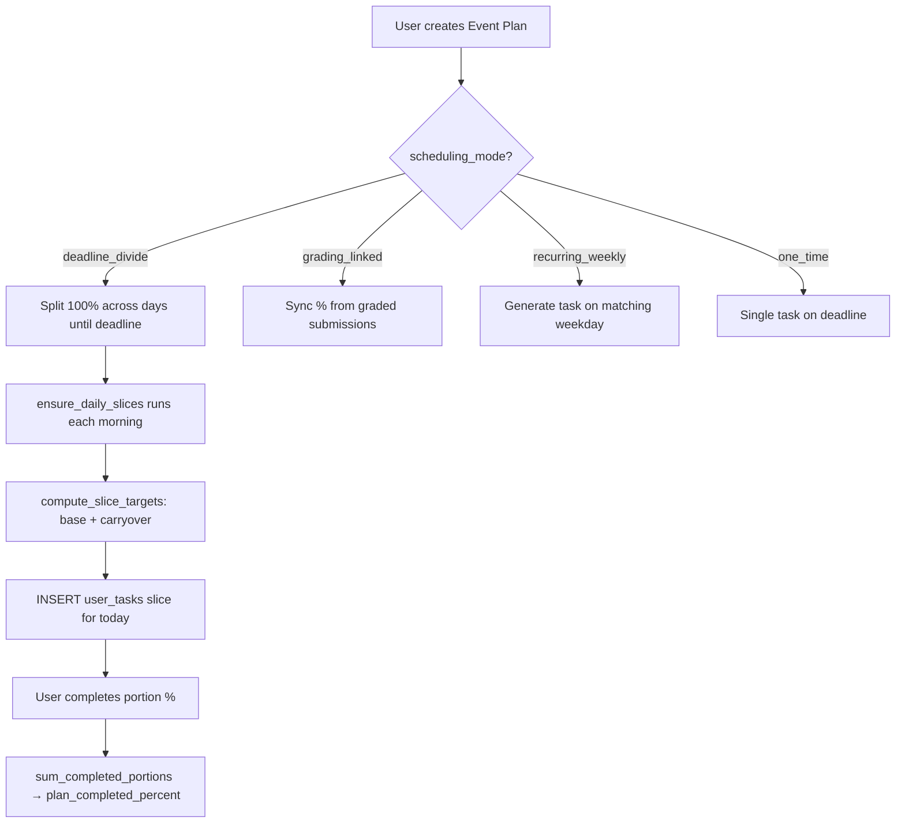

# DisciPlan — SQL Queries Reference

> **Architecture:** All queries live in `DisciPlan-backend/app/repositories/` and `app/services/`.  
> **Pattern:** Parameterized raw SQL via `asyncmy` — no ORM.  
> **Security:** Every user input bound as `%s` placeholder — SQL injection safe.

---

## Table of Contents

1. [Event Plan Mechanism](#1-event-plan-mechanism) ⭐ Priority
2. [Task Sorting & Weighting](#2-task-sorting--weighting) ⭐ Priority
3. [Fuzzy Doubt Search](#3-fuzzy-doubt-search) ⭐ Priority
4. [Daily Energy & Routine](#4-daily-energy--routine)
5. [Calendar & Merged View](#5-calendar--merged-view)
6. [Section Hub Queries](#6-section-hub-queries)
7. [Blogs, Forum, Practice](#7-blogs-forum-practice)
8. [Teams & Chat](#8-teams--chat)
9. [Assessments & Grading](#9-assessments--grading)
10. [Gamification & Leaderboard](#10-gamification--leaderboard)
11. [Auth & Admin](#11-auth--admin)
12. [SQL Views](#12-sql-views)

---

## 1. Event Plan Mechanism

**Files:** `app/services/event_plan_service.py`, `app/repositories/event_plan_repo.py`  
**Tables:** `planner_event_plans`, `planner_event_recurrence`, `user_tasks`, `calendar_events`

### 1.1 Concept

When a student adds a big deadline (e.g. "Database CT — March 20"), DisciPlan creates an **event plan** that:

1. Divides 100% work across remaining days (`deadline_divide` mode).
2. Creates one **daily slice** (`user_tasks` row per `slice_date`).
3. **Carries over** unfinished % from yesterday into today's target.
4. Sends a notification when backlog rolls forward.
5. Supports **grading-linked** plans that auto-sync from submission portal grading %.



### 1.2 Create Event Plan

**Purpose:** Store the parent plan record with scheduling mode and deadline.

**File:** `event_plan_repo.py` → `create_plan()`

```sql
INSERT INTO planner_event_plans (
    owner_user_id, title, description, planner_task_type_id,
    course_id, section_id, scheduling_mode, deadline_at,
    portal_id, grade_component_id, priority_id, energy_level_id,
    estimated_effort_min
) VALUES (%s, %s, %s, %s, %s, %s, %s, %s, %s, %s, %s, %s, %s);
```

| Column | Role |
|--------|------|
| `scheduling_mode` | `deadline_divide` \| `grading_linked` \| `one_time` \| `recurring_weekly` \| `calendar_only` |
| `deadline_at` | Final due datetime for divide/one-time modes |
| `portal_id` | Links to `assessment_portals` for grading sync |
| `grade_component_id` | Links to `section_grade_components` rubric item |

### 1.3 Fetch Active Divide Plans (Daily Slice Generator)

**Purpose:** Find all plans that need a task slice created for today.

**File:** `event_plan_service.py` → `fetch_all_active_divide_plans()`

```sql
SELECT pep.*, pep.priority_id, pep.energy_level_id, pep.planner_task_type_id
FROM planner_event_plans pep
WHERE pep.owner_user_id = %s
  AND pep.is_active = 1
  AND pep.is_completed = 0
  AND pep.scheduling_mode IN ('deadline_divide', 'grading_linked')
  AND pep.deadline_at IS NOT NULL
  AND DATE(pep.deadline_at) >= %s;
```

**How it works:** Called by `ensure_daily_slices()` when user opens dashboard. For each plan without a slice for `target_date`, a new `user_tasks` row is inserted.

### 1.4 Insert Daily Slice Task

**Purpose:** Create today's portion of an event plan as a trackable task.

**File:** `event_plan_service.py` → `_insert_task()`

```sql
INSERT INTO user_tasks (
    user_id, course_id, section_id, planner_task_type_id,
    title, description, priority_id, energy_level_id,
    estimated_effort_min, due_at, original_due_at, scheduled_for_date,
    source, calendar_event_id, event_plan_id, slice_date,
    base_target_percent, carryover_percent, effective_target_percent,
    completed_portion_percent, days_behind, was_skipped_forward,
    weight_profile, occurrence_starts_at, completion_percent, is_completed
) VALUES (...);
```

| Column | Meaning |
|--------|---------|
| `base_target_percent` | Today's fair share: `100 / days_remaining` |
| `carryover_percent` | Unfinished % rolled from yesterday |
| `effective_target_percent` | `min(100, base + carryover)` — what user must do today |
| `completed_portion_percent` | How much user actually completed |
| `slice_date` | Which calendar day this slice belongs to |
| `source` | `event_slice` or `grading_linked` |

### 1.5 Carryover Algorithm (Python + SQL)

**Purpose:** Calculate how much work carries from yesterday.

**File:** `event_plan_service.py` → `compute_slice_targets()`

```sql
-- Get yesterday's slice
SELECT id, effective_target_percent, completed_portion_percent, is_skipped, slice_closed
FROM user_tasks
WHERE event_plan_id = %s AND user_id = %s AND slice_date = %s
LIMIT 1;

-- Sum all prior completed portions (for deadline day calculation)
SELECT COALESCE(SUM(completed_portion_percent), 0) AS total
FROM user_tasks
WHERE event_plan_id = %s AND is_skipped = 0
  AND slice_date < %s;  -- optional: before today
```

**Logic (Python):**
```
if yesterday was skipped OR yesterday.completed < yesterday.effective:
    carryover = yesterday.effective - yesterday.completed

if today >= deadline:
    base = max(0, 100 - prior_total_done)
else:
    base = 100 / days_remaining

effective = min(100, base + carryover)
```

### 1.6 Grading-Linked Sync

**Purpose:** Auto-update plan progress from how many students have been graded.

**File:** `event_plan_service.py` → `_grading_percent()`

```sql
-- Count enrolled students
SELECT COUNT(*) AS n FROM section_enrollments
WHERE section_id = %s AND dropped_at IS NULL;

-- Count graded submissions for a portal
SELECT COUNT(*) AS n FROM submissions sub
INNER JOIN submission_statuses ss ON ss.id = sub.status_id
WHERE sub.portal_id = %s AND ss.code = 'graded';
```

**Formula:** `grading_percent = (graded_count / enrolled_count) * 100`

This % becomes `completion_percent` and `completed_portion_percent` on today's slice task.

### 1.7 Recurring Weekly Occurrences

**Purpose:** Materialize today's task for weekly recurring plans (e.g. "Team meeting every Tuesday").

**File:** `event_plan_service.py` → `_ensure_recurring_today()`

```sql
SELECT pep.*, per.day_of_week, per.starts_time, per.duration_min
FROM planner_event_plans pep
INNER JOIN planner_event_recurrence per ON per.plan_id = pep.id
WHERE pep.owner_user_id = %s
  AND pep.is_active = 1
  AND pep.is_completed = 0
  AND pep.scheduling_mode = 'recurring_weekly'
  AND per.day_of_week = %s;
```

### 1.8 Plan Completion & Future Slice Cancellation

```sql
-- Sum all completed portions
SELECT COALESCE(SUM(completed_portion_percent), 0) AS total
FROM user_tasks WHERE event_plan_id = %s AND is_skipped = 0;

-- Mark plan complete at 100%
UPDATE planner_event_plans
SET is_completed = 1, completed_at = UTC_TIMESTAMP(3), plan_completed_percent = 100
WHERE id = %s;

-- Skip all future open slices
UPDATE user_tasks
SET is_skipped = 1, skipped_at = UTC_TIMESTAMP(3)
WHERE event_plan_id = %s AND user_id = %s
  AND slice_date >= %s AND is_completed = 0;
```

### 1.9 Expire Past-Deadline Plans

```sql
UPDATE planner_event_plans
SET is_active = 0
WHERE owner_user_id = %s AND is_active = 1
  AND deadline_at IS NOT NULL
  AND DATE(deadline_at) < CURDATE();
```

---

## 2. Task Sorting & Weighting

**File:** `app/repositories/task_planner_repo.py`  
**Tables:** `user_tasks`, `task_priorities`, `energy_levels`, `user_daily_energy`

### 2.1 Concept

Today's task queue is **not sorted by due date alone**. Each task gets a **live_weight** computed at query time using a multi-factor formula. When the user sets their daily energy, tasks whose `energy_level` best matches sort higher.

### 2.2 Live Weight Formula (Planner Profile)

**Used for:** Manual tasks, event slices, rescheduled work.

```sql
(
    tp.sort_order * 10.0
    * (1.0 + GREATEST(0, TIMESTAMPDIFF(HOUR, UTC_TIMESTAMP(3), COALESCE(ut.due_at, UTC_TIMESTAMP(3)))) / -24.0)
    * (1.0 + (100 - ut.completion_percent) / 100.0)
    * (1.0 + ut.reschedule_count * 0.25)
    * (1.0 + COALESCE(ut.carryover_percent, 0) / 50.0)
    * (1.0 + COALESCE(ut.days_behind, 0) * 0.15)
    * CASE WHEN ut.is_skipped = 1 THEN 0 ELSE 1 END
) AS live_weight
```

| Factor | Effect |
|--------|--------|
| `tp.sort_order * 10` | Base priority (critical > high > med > low) |
| Due date proximity | Closer deadline → higher weight (hours/24) |
| `(100 - completion_percent)` | Partially done tasks stay visible |
| `reschedule_count * 0.25` | Rescheduled tasks bubble up |
| `carryover_percent / 50` | Event plan backlog increases urgency |
| `days_behind * 0.15` | Multi-day slippage penalty |
| `is_skipped` | Skipped tasks weight = 0 (hidden from sort) |

### 2.3 Live Weight Formula (Scheduled Profile)

**Used for:** Recurring occurrences, calendar-tied one-time events.

```sql
(
    tp.sort_order * 10.0
    * (1.0 + GREATEST(0, TIMESTAMPDIFF(HOUR, UTC_TIMESTAMP(3), COALESCE(ut.occurrence_starts_at, ut.due_at, UTC_TIMESTAMP(3)))) / -12.0)
    * (1.0 + (100 - ut.completion_percent) / 100.0)
    * CASE WHEN ut.is_skipped = 1 THEN 0 ELSE 1 END
) AS live_weight
```

Uses `occurrence_starts_at` (tighter 12-hour window) instead of carryover/reschedule factors.

### 2.4 List Today's Tasks (Core Sort Query)

**Purpose:** Return today's queue sorted by energy fit then live weight.

**File:** `task_planner_repo.py` → `list_tasks_for_day()`

```sql
SELECT
    ut.id, ut.title, ut.description, ut.due_at, ut.is_completed,
    ut.completion_percent, ut.source, ut.event_plan_id, ut.slice_date,
    ut.base_target_percent, ut.carryover_percent, ut.effective_target_percent,
    ut.completed_portion_percent, ut.days_behind,
    c.code AS course_code,
    tp.code AS priority_code,
    el.code AS energy_level_code,
    el.sort_order AS energy_sort_order,
    ptt.code AS planner_task_type_code,
    {WEIGHT_EXPR} AS live_weight
FROM user_tasks ut
LEFT JOIN courses c ON c.id = ut.course_id
INNER JOIN task_priorities tp ON tp.id = ut.priority_id
LEFT JOIN energy_levels el ON el.id = ut.energy_level_id
LEFT JOIN planner_task_types ptt ON ptt.id = ut.planner_task_type_id
WHERE ut.user_id = %s
  AND ut.is_skipped = 0
  AND (
    ut.scheduled_for_date = %s
    OR (ut.scheduled_for_date IS NULL AND DATE(ut.due_at) = %s)
    OR (ut.scheduled_for_date IS NULL AND ut.due_at IS NULL AND ut.is_completed = 0)
  )
ORDER BY
    ut.is_completed ASC,
    ABS(COALESCE(el.sort_order, 2) - {user_energy_sort}) ASC,  -- energy match
    live_weight DESC,
    ut.due_at ASC,
    ut.id ASC;
```

**Sort order explained:**
1. Incomplete tasks first
2. Tasks matching today's energy level (low-energy day → easy tasks first)
3. Highest live_weight (most urgent)
4. Earliest due date
5. Stable tie-break by id

### 2.5 Auto-Reschedule Overdue Tasks

**Purpose:** Roll missed planner tasks to tomorrow and increment reschedule count.

**File:** `task_planner_repo.py` → `reschedule_overdue_tasks()`

```sql
UPDATE user_tasks
SET
    reschedule_count = reschedule_count + 1,
    due_at = DATE_ADD(COALESCE(due_at, UTC_TIMESTAMP(3)), INTERVAL 1 DAY),
    scheduled_for_date = DATE_ADD(COALESCE(scheduled_for_date, DATE(UTC_TIMESTAMP(3))), INTERVAL 1 DAY),
    original_due_at = COALESCE(original_due_at, due_at),
    source = CASE WHEN source = 'lecture_auto' THEN source ELSE 'reschedule' END
WHERE user_id = %s
  AND is_completed = 0
  AND is_skipped = 0
  AND completion_percent < 100
  AND due_at IS NOT NULL
  AND due_at < UTC_TIMESTAMP(3)
  AND source NOT IN ('event_slice', 'grading_linked', 'recurring_occurrence', 'one_time')
  AND COALESCE(weight_profile, 'planner') = 'planner'
  AND event_plan_id IS NULL;
```

**Note:** Event plan slices are **excluded** — they use carryover instead of reschedule.

### 2.6 Recompute Stored Weights

```sql
UPDATE user_tasks ut
INNER JOIN task_priorities tp ON tp.id = ut.priority_id
SET ut.computed_weight = {WEIGHT_EXPR}
WHERE ut.user_id = %s;
```

Runs after every task create/update to keep `computed_weight` column in sync.

---

## 3. Fuzzy Doubt Search

**File:** `app/repositories/section_repo.py` → `search_doubts()`  
**Tables:** `section_doubts`, `section_doubt_answers`, `sections`, `courses`, `user_profiles`  
**Indexes:** `FULLTEXT ft_section_doubts_title_body`, `FULLTEXT ft_doubt_answers_body` (migration 023)

### 3.1 Concept

The doubts page lets students search across **all enrolled sections** with fuzzy matching on:
- Doubt title and body
- Answer bodies
- Course code
- Author display name

Uses a **hybrid** approach: MySQL FULLTEXT (BOOLEAN MODE for tokens) + case-insensitive LIKE fallbacks + relevance scoring.

### 3.2 Access Scope Query

**Purpose:** Only search sections the user can access.

```sql
-- Students: enrolled sections in current semester
SELECT s.id
FROM sections s
INNER JOIN semesters sem ON sem.id = s.semester_id AND sem.is_current = 1
INNER JOIN section_enrollments se ON se.section_id = s.id
  AND se.student_user_id = %s AND se.dropped_at IS NULL;

-- Faculty: assigned sections
SELECT s.id FROM sections s
INNER JOIN semesters sem ON sem.id = s.semester_id AND sem.is_current = 1
INNER JOIN section_faculty sf ON sf.section_id = s.id AND sf.faculty_user_id = %s;
```

### 3.3 Search Filter Construction (Python → SQL)

For query `"binary tree traversal"`:

1. **Tokenize:** `["binary", "tree", "traversal"]`
2. **BOOLEAN FULLTEXT:** `"binary* tree* traversal*"` (prefix match per token)
3. **LIKE whole phrase:** `%binary tree traversal%` on title, body, course code, author
4. **Per-token LIKE:** each token in title, body, and answer bodies

```sql
WHERE d.section_id IN (?, ?, ...)   -- accessible sections
  AND d.deleted_at IS NULL
  AND (
    -- FULLTEXT on doubt title+body
    MATCH(d.title, d.body) AGAINST ('binary* tree* traversal*' IN BOOLEAN MODE)
    -- OR whole-phrase LIKE
    OR LOWER(d.title) LIKE LOWER('%binary tree traversal%')
    OR LOWER(d.body) LIKE LOWER('%binary tree traversal%')
    OR UPPER(c.code) LIKE UPPER('%binary tree traversal%')
    OR LOWER(COALESCE(up.display_name, '')) LIKE LOWER('%binary tree traversal%')
    -- OR answer body match
    OR EXISTS (
      SELECT 1 FROM section_doubt_answers a
      WHERE a.doubt_id = d.id AND a.deleted_at IS NULL
        AND (
          MATCH(a.body) AGAINST ('binary* tree* traversal*' IN BOOLEAN MODE)
          OR LOWER(a.body) LIKE LOWER('%binary tree traversal%')
        )
    )
    -- OR per-token match (any token in title/body/answers)
    OR (
      LOWER(d.title) LIKE LOWER('%binary%') OR LOWER(d.body) LIKE LOWER('%binary%')
      OR EXISTS (SELECT 1 FROM section_doubt_answers a2 WHERE a2.doubt_id = d.id
                 AND a2.deleted_at IS NULL AND LOWER(a2.body) LIKE LOWER('%binary%'))
      OR ... -- repeated per token
    )
  )
```

### 3.4 Relevance Scoring

**Purpose:** Rank results — title matches beat body matches; verified doubts preferred.

```sql
SELECT
    d.id, d.title, d.body, d.is_verified, d.created_at,
    c.code AS course_code, s.section_label,
    COALESCE(up.display_name, 'Student') AS author_name,
    (
      IFNULL(MATCH(d.title, d.body) AGAINST (%s IN NATURAL LANGUAGE MODE), 0) * 4
      + IF(LOWER(d.title) LIKE LOWER(%s), 8, 0)
      + IF(LOWER(d.body) LIKE LOWER(%s), 4, 0)
      + IF(UPPER(c.code) LIKE UPPER(%s), 3, 0)
      + IF(LOWER(COALESCE(up.display_name, '')) LIKE LOWER(%s), 2, 0)
      + IF(EXISTS (
          SELECT 1 FROM section_doubt_answers ar
          WHERE ar.doubt_id = d.id AND ar.deleted_at IS NULL
            AND LOWER(ar.body) LIKE LOWER(%s)
        ), 5, 0)
    ) AS relevance_score
FROM section_doubts d
INNER JOIN sections s ON s.id = d.section_id
INNER JOIN courses c ON c.id = s.course_id
LEFT JOIN user_profiles up ON up.user_id = d.author_user_id
WHERE {where_sql}
ORDER BY relevance_score DESC, d.is_verified DESC, d.created_at DESC
LIMIT %s OFFSET %s;
```

| Score component | Points |
|-----------------|--------|
| FULLTEXT natural language match | ×4 |
| Title LIKE exact phrase | +8 |
| Body LIKE exact phrase | +4 |
| Course code match | +3 |
| Author name match | +2 |
| Answer body match | +5 |

### 3.5 Count Query (Pagination)

```sql
SELECT COUNT(*) AS n
FROM section_doubts d
INNER JOIN sections s ON s.id = d.section_id
INNER JOIN courses c ON c.id = s.course_id
LEFT JOIN user_profiles up ON up.user_id = d.author_user_id
WHERE {same filters as search};
```

**API endpoint:** `GET /api/v1/sections/doubts/search?q=...&course_code=...&section=...&status=resolved`

---

## 4. Daily Energy & Routine

### Set Daily Energy

```sql
INSERT INTO user_daily_energy (user_id, energy_date, energy_level_id)
VALUES (%s, %s, %s)
ON DUPLICATE KEY UPDATE energy_level_id = VALUES(energy_level_id), set_at = UTC_TIMESTAMP(3);
```

### Get Today's Energy

```sql
SELECT ude.energy_date, el.code AS energy_level_code, el.sort_order AS energy_sort_order
FROM user_daily_energy ude
INNER JOIN energy_levels el ON el.id = ude.energy_level_id
WHERE ude.user_id = %s AND ude.energy_date = %s;
```

### Weekly Class Routine

```sql
SELECT s.id AS section_id, c.code AS course_code, c.title AS course_title,
       s.section_label, s.room, smt.id AS meeting_time_id,
       dow.code AS day_code, dow.label AS day_label, dow.sort_order AS day_sort_order,
       smt.starts_at, smt.ends_at
FROM sections s
INNER JOIN courses c ON c.id = s.course_id
INNER JOIN semesters sem ON sem.id = s.semester_id AND sem.is_current = 1
INNER JOIN section_enrollments se ON se.section_id = s.id
  AND se.student_user_id = %s AND se.dropped_at IS NULL
LEFT JOIN section_meeting_times smt ON smt.section_id = s.id
LEFT JOIN days_of_week dow ON dow.id = smt.day_id
WHERE s.is_active = 1
ORDER BY dow.sort_order, smt.starts_at, c.code;
```

---

## 5. Calendar & Merged View

### List Calendar Events

```sql
SELECT ce.id, ce.title, ce.description, ce.starts_at, ce.ends_at, ce.all_day,
       c.code AS course_code, ce.event_plan_id, 'event' AS item_type
FROM calendar_events ce
LEFT JOIN courses c ON c.id = ce.course_id
WHERE ce.owner_user_id = %s
ORDER BY ce.starts_at ASC;
```

### Merged Calendar (Events + Task Due Dates)

```sql
-- Tasks with due_at appear as calendar blocks
SELECT ut.id, ut.title, ut.due_at AS starts_at,
       DATE_ADD(ut.due_at, INTERVAL COALESCE(ut.estimated_effort_min, 60) MINUTE) AS ends_at,
       c.code AS course_code, ut.event_plan_id, 'task' AS item_type,
       ut.completion_percent, ut.is_completed
FROM user_tasks ut
LEFT JOIN courses c ON c.id = ut.course_id
WHERE ut.user_id = %s AND ut.due_at IS NOT NULL AND ut.is_skipped = 0
ORDER BY ut.due_at ASC;
```

---

## 6. Section Hub Queries

| Query | File | Purpose |
|-------|------|---------|
| `list_announcements` | `section_repo.py` | Section feed with author |
| `create_announcement` | `section_repo.py` | Post + notify all enrollees |
| `list_doubts` | `section_repo.py` | Section doubt list |
| `list_resources` | `section_repo.py` | Files/links with Cloudinary URL |
| `list_portals` | `assessment_repo.py` | Exam/assignment portals |
| `list_submissions` | `assessment_repo.py` | Faculty grading queue |
| `list_gradebook` | `assessment_repo.py` | Student × component matrix |

### Announcement Notification (Bulk Insert)

```sql
INSERT INTO notifications (recipient_user_id, type_id, title, body_preview,
    reference_type_id, reference_id, action_path)
SELECT se.student_user_id, ?, ?, LEFT(?, 300), ?, ?,
    CONCAT('/courses/', REPLACE(LOWER(%s), ' ', '-'), '/section?section=', %s, '&tab=announcements')
FROM section_enrollments se
WHERE se.section_id = %s AND se.dropped_at IS NULL AND se.student_user_id <> %s;
```

---

## 7. Blogs, Forum, Practice

### Blog List with Vote Score

```sql
SELECT bp.id, bp.title, bp.slug, bp.excerpt, bp.published_at,
       COALESCE(SUM(vd.value), 0) AS score
FROM blog_posts bp
LEFT JOIN blog_post_votes bpv ON bpv.post_id = bp.id
LEFT JOIN vote_directions vd ON vd.id = bpv.direction_id
WHERE bp.course_id = %s AND bp.deleted_at IS NULL AND bp.status_id = (published)
GROUP BY bp.id
ORDER BY bp.is_pinned DESC, score DESC, bp.published_at DESC;
```

### Forum Thread Feed

```sql
SELECT ft.id, ft.title, ft.body, ft.created_at,
       ftt.code AS thread_type_code,
       (SELECT COUNT(*) FROM forum_replies fr WHERE fr.thread_id = ft.id) AS reply_count
FROM forum_threads ft
INNER JOIN forum_thread_types ftt ON ftt.id = ft.thread_type_id
WHERE ft.course_id = %s AND ft.deleted_at IS NULL
ORDER BY ft.created_at DESC;
```

### Practice Problems by Topic

```sql
SELECT pp.id, pp.title, pp.question_text, pp.answer_text, pp.difficulty_score,
       st.title AS topic_title, at.code AS assessment_type_code
FROM practice_problems pp
LEFT JOIN syllabus_topics st ON st.id = pp.topic_id
INNER JOIN assessment_types at ON at.id = pp.assessment_type_id
WHERE pp.course_id = %s
  AND (pp.section_id IS NULL OR pp.section_id = %s)
ORDER BY st.sort_order, pp.difficulty_score;
```

---

## 8. Teams & Chat

### Team Detail with Members

```sql
SELECT t.id, t.name AS team_name, t.leader_user_id, c.code AS course_code,
       u.email AS leader_email, up.display_name AS leader_name
FROM teams t
INNER JOIN courses c ON c.id = t.course_id
LEFT JOIN users u ON u.id = t.leader_user_id
LEFT JOIN user_profiles up ON up.user_id = u.id
WHERE t.id = %s AND t.disbanded_at IS NULL;
```

### Chat Messages (Keyset Pagination)

```sql
SELECT cm.id, cm.body, cm.created_at, cm.sender_user_id,
       up.display_name AS sender_name
FROM chat_messages cm
INNER JOIN users u ON u.id = cm.sender_user_id
LEFT JOIN user_profiles up ON up.user_id = u.id
WHERE cm.group_id = %s AND cm.id > %s AND cm.deleted_at IS NULL
ORDER BY cm.id ASC
LIMIT %s;
```

### Unread Chat Count (via View)

```sql
SELECT unread_count FROM v_chat_group_unread_counts
WHERE user_id = %s AND group_id = %s;
```

---

## 9. Assessments & Grading

### Grade Submission + Notify Student

```sql
UPDATE submissions
SET status_id = %s, score = %s, feedback = %s,
    graded_by_user_id = %s, graded_at = UTC_TIMESTAMP(3)
WHERE id = %s;

-- Notification with deep link to submissions page
INSERT INTO notifications (..., action_path)
VALUES (..., '/courses/{slug}/submissions?section={label}');
```

---

## 10. Gamification & Leaderboard

### Award Points (with cap check)

```sql
INSERT INTO point_transactions (user_id, delta_points, reason_code, reference_type, reference_id)
VALUES (%s, %s, %s, %s, %s);

UPDATE user_gamification
SET total_points = total_points + %s,
    tier_id = (SELECT id FROM gamification_tiers
               WHERE min_points <= user_gamification.total_points + %s
               ORDER BY min_points DESC LIMIT 1)
WHERE user_id = %s;
```

### Leaderboard (View)

```sql
SELECT user_id, display_name, total_points, tier_code, tier_label, rank_position
FROM v_leaderboard_all_time
ORDER BY rank_position ASC
LIMIT 50;
```

---

## 11. Auth & Admin

### Login

```sql
SELECT u.id, u.email, u.password_hash, r.code AS role_code, us.code AS status_code
FROM users u
INNER JOIN roles r ON r.id = u.role_id
INNER JOIN user_statuses us ON us.id = u.status_id
WHERE u.email = %s;
```

### Faculty Roster Check

```sql
SELECT id, email, display_name, status
FROM faculty_roster
WHERE LOWER(email) = LOWER(%s) AND status IN ('pending', 'claimed');
```

### Admin Enrollment Approval

```sql
INSERT INTO section_enrollments (section_id, student_user_id)
VALUES (%s, %s);

UPDATE section_enrollment_requests
SET status = 'approved', reviewed_by_user_id = %s, reviewed_at = UTC_TIMESTAMP(3)
WHERE id = %s;
```

---

## 12. SQL Views

Defined in `sql/003_views.sql` and `sql/007_views_leaderboard.sql`:

| View | Purpose |
|------|---------|
| `v_user_unread_notification_counts` | Bell icon badge count |
| `v_chat_group_last_messages` | Last message preview per group |
| `v_chat_group_unread_counts` | Unread messages per user per group |
| `v_section_enrollment_counts` | Active student count per section |
| `v_blog_post_scores` | Net vote score per blog post |
| `v_leaderboard_all_time` | Ranked users by total XP |
| `v_leaderboard_today` | Today's XP earners |

---

## Query File Map

| Repository file | Domain |
|-----------------|--------|
| `task_planner_repo.py` | Tasks, energy, routine, calendar merge, weights |
| `event_plan_repo.py` | Event plans, slices, recurrence, grading counts |
| `event_plan_service.py` | Slice orchestration, carryover, recurring materialization |
| `section_repo.py` | Doubts, announcements, resources, **fuzzy search** |
| `dashboard_repo.py` | Calendar events CRUD |
| `assessment_repo.py` | Portals, submissions, gradebook |
| `blog_repo.py` | Posts, votes, comments |
| `forum_repo.py` | Threads, replies, votes |
| `practice_repo.py` | Problems, past papers |
| `team_repo.py` | Teams, tasks, invitations |
| `chat_repo.py` | Messages, reads, groups |
| `gamification_repo.py` | Points, tiers, achievements, streaks |
| `auth_repo.py` | Users, OTP, refresh tokens |
| `admin_repo.py` | Courses, sections, enrollments, audit |
| `notification_repo.py` | Notifications CRUD + bulk inserts |

---

*All queries use parameterized `%s` placeholders. Never concatenate user input into SQL strings.*
